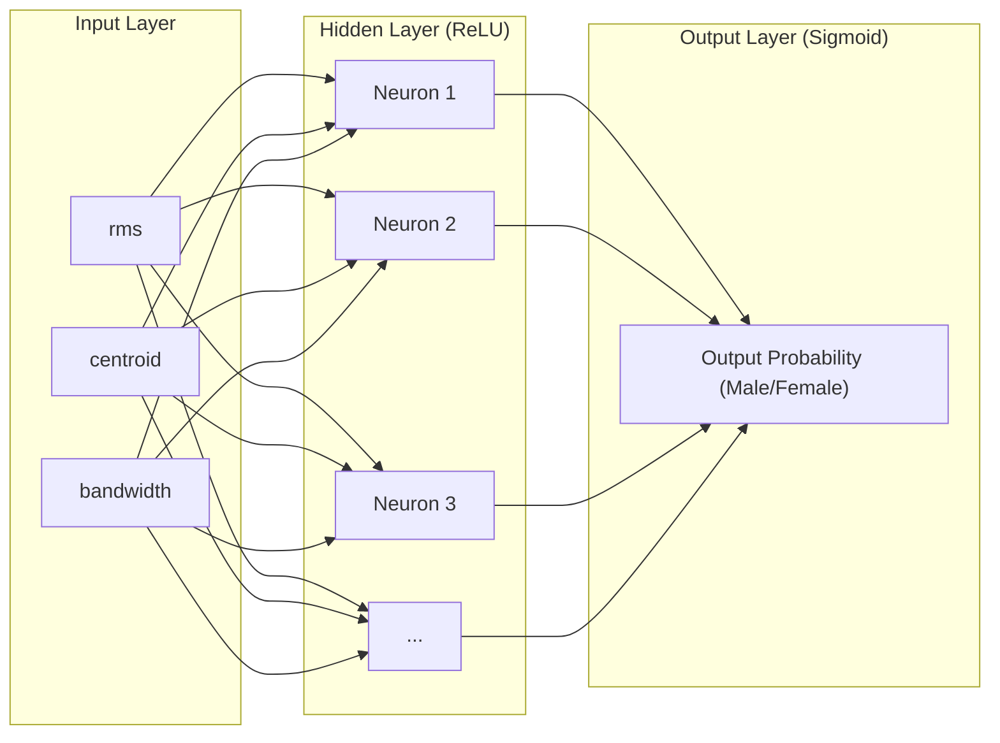

# Implementing Neural Networks for Voice Gender Recognition

This guide explains the fundamental concepts of Artificial Neural Networks (ANNs) and provides a step-by-step breakdown of your PyTorch implementation in [Neural Network.ipynb](file:///Users/viduranayanawickrama/Desktop/Projects/Gender_Recognition_By_Voice_ML/01V_models/Neural%20Network.ipynb).

---

## 1. What is an Artificial Neural Network?

An **Artificial Neural Network (ANN)** is a machine learning model inspired by the structure and function of biological brains. It consists of interconnected processing units called **neurons** (or nodes) organized into layers.



### Core Concepts:
- **Layers**: 
  - **Input Layer**: Receives features from the dataset (e.g., `rms`, `centroid`, `bandwidth`).
  - **Hidden Layers**: Perform non-linear transformations on the inputs to extract patterns.
  - **Output Layer**: Produces the final prediction (e.g., probability of the voice being `female` vs `male`).
- **Weights & Biases ($W, b$)**: The learnable parameters of the network. Every connection has a weight, and every neuron has a bias. They determine the strength and shift of the signal.
- **Activation Functions**: Introduce non-linearity so the network can learn complex, non-linear relationships.
  - **ReLU (Rectified Linear Unit)**: Outputs $f(x) = \max(0, x)$. Used in hidden layers to avoid the vanishing gradient problem.
  - **Sigmoid**: Outputs a value between $0$ and $1$, representing probability. Used in output layers for binary classification.
- **Forward Pass**: Calculating the output predictions by passing inputs through the layers.
- **Loss Function**: Measures the error between the model's prediction and the actual target. In binary classification, we use **Binary Cross-Entropy (BCE) Loss**.
- **Backpropagation & Optimization**: Calculating the gradient of the loss function with respect to weights/biases (using the chain rule) and adjusting them using optimizers like **Adam** to minimize the loss.

---

## 2. Step-by-Step PyTorch Implementation Breakdown

Here is how the neural network is structured and trained in [Neural Network.ipynb](file:///Users/viduranayanawickrama/Desktop/Projects/Gender_Recognition_By_Voice_ML/01V_models/Neural%20Network.ipynb).

### Step 2.1: Preprocessing & Scaling
Just like KNN, neural networks are highly sensitive to feature scales since they use gradient descent to find optimal weights.

```python
# Split into training and testing sets
X_train, X_test, y_train, y_test = train_test_split(X, y_encoded, train_size=0.8, random_state=26)

# Scale features to mean = 0, standard deviation = 1
scaler = StandardScaler()
X_train_scaled = scaler.fit_transform(X_train)
X_test_scaled = scaler.transform(X_test)
```

### Step 2.2: Creating PyTorch Datasets & DataLoaders
PyTorch uses `Dataset` and `DataLoader` classes to handle batching, shuffling, and memory management during training.

```python
class VoiceDataset(Dataset):
    def __init__(self, X, y):
        # Convert NumPy arrays into PyTorch Tensors
        self.X = torch.tensor(X, dtype=torch.float32)
        self.y = torch.tensor(y, dtype=torch.float32).unsqueeze(1)
        
    def __len__(self):
        return len(self.X)
        
    def __getitem__(self, idx):
        return self.X[idx], self.y[idx]

# DataLoader yields batches of size 64
train_loader = DataLoader(train_dataset, batch_size=64, shuffle=True)
test_loader = DataLoader(test_dataset, batch_size=64, shuffle=False)
```

### Step 2.3: Defining the Model Architecture
The network is structured using `nn.Sequential` to stack linear transformations, activations, and dropout layers.

```python
class VoiceGenderClassifier(nn.Module):
    def __init__(self, input_dim):
        super(VoiceGenderClassifier, self).__init__()
        self.network = nn.Sequential(
            # Input Layer (3 features) -> Hidden Layer 1 (32 neurons)
            nn.Linear(input_dim, 32),
            nn.ReLU(),
            nn.Dropout(0.2),  # Randomly turns off 20% of neurons to prevent overfitting
            
            # Hidden Layer 1 (32 neurons) -> Hidden Layer 2 (16 neurons)
            nn.Linear(32, 16),
            nn.ReLU(),
            nn.Dropout(0.2),
            
            # Hidden Layer 2 (16 neurons) -> Output Layer (1 probability node)
            nn.Linear(16, 1),
            nn.Sigmoid()      # Outputs probability between 0 and 1
        )
        
    def forward(self, x):
        return self.network(x)
```

### Step 2.4: Training Loop
During training, the model iterates through the dataset multiple times (**Epochs**). In each epoch, it computes gradients and updates weights.

```python
criterion = nn.BCELoss() # Binary Cross-Entropy Loss
optimizer = optim.Adam(model.parameters(), lr=0.005) # Adam optimizer with learning rate 0.005

model.train()
for epoch in range(EPOCHS):
    for batch_X, batch_y in train_loader:
        # 1. Clear previous gradients
        optimizer.zero_grad()
        
        # 2. Forward pass: compute predictions
        outputs = model(batch_X)
        
        # 3. Calculate loss
        loss = criterion(outputs, batch_y)
        
        # 4. Backward pass: compute gradients
        loss.backward()
        
        # 5. Update weights
        optimizer.step()
```

### Step 2.5: Evaluation
To evaluate, the model is placed in evaluation mode (`model.eval()`), which disables dropout layers. Gradient calculation is also disabled (`with torch.no_grad()`) to save memory.

```python
model.eval()
with torch.no_grad():
    for batch_X, batch_y in test_loader:
        outputs = model(batch_X)
        # Classify as 1 (female/male) if output probability is >= 0.5
        predictions = (outputs >= 0.5).float()
```

---

## 3. How to Run This Code

To run this model, make sure you have PyTorch installed:

```bash
pip install torch torchvision
```

Open [Neural Network.ipynb](file:///Users/viduranayanawickrama/Desktop/Projects/Gender_Recognition_By_Voice_ML/01V_models/Neural%20Network.ipynb) in VS Code or Jupyter and execute the cells sequentially. The code will automatically utilize your Mac's **Apple Silicon GPU (MPS)** if available, or fall back to **CPU**.
